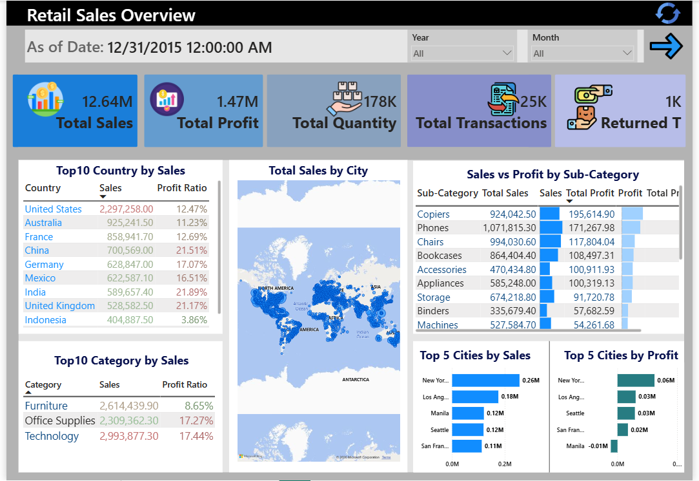

# Transaction-Analysis-Dashboard-PowerBI
Interactive Power BI dashboard analyzing transaction data, sales performance, KPIs, and business insights through data visualization.

# 📊 Transaction Analysis Dashboard | Power BI

This project is an interactive **Power BI Transaction Analysis Dashboard** designed to analyze transaction data, customer insights, product performance, sales metrics, and business KPIs.

The main objective of this project is to transform raw transaction data into meaningful insights using **Power BI, DAX calculations, data modeling, and interactive visualizations.**

---

# 📊 Analysis Key

This project focuses on analyzing transaction data to identify important business insights and performance indicators.

The dashboard provides analysis of:

- Total Transactions
- Total Sales
- Total Profit
- Total Quantity
- Returned Transactions
- Customer Segment Performance
- Product Performance
- Category Analysis
- Regional Analysis
- Sales Trends

The project workflow includes:

1. Importing transaction dataset
2. Data preparation and transformation
3. Creating data relationships
4. Developing calculated measures using DAX
5. Designing interactive dashboard pages
6. Extracting business insights from transaction data

---

# 🗝 Key Concepts Used

## Power BI

- Interactive dashboard development
- Data visualization
- KPI monitoring
- Report development
- Business intelligence reporting

## Data Modeling

- Data relationships
- Data transformation
- Fact and dimension tables
- Structured analytical models

## DAX

- Calculated measures
- Transaction KPIs
- Sales calculations
- Profit calculations
- Average transaction metrics
- Return rate calculations

## Analytics Concepts

- Transaction analysis
- Customer analysis
- Product analysis
- Performance comparison
- Trend analysis
- Data-driven decision making

---

# 📈 Outputs

The final dashboard provides:

✅ Transaction performance overview  
✅ Customer & Product analysis  
✅ Sales and profit insights  
✅ Transaction KPI tracking  
✅ Product performance comparison  
✅ Regional transaction analysis  
✅ Interactive Year and Month filters  


## Dashboard KPIs

The report includes:

- Total Sales
- Total Profit
- Total Quantity
- Total Transactions
- Returned Transactions
- Average Sales per Transaction
- Average Quantity per Transaction
- Return Rate


## Dashboard Pages

### 1. Transaction Overview



Provides a general overview of transaction performance with key business metrics, geographical analysis, category performance, and sales insights.

### 2. Customer & Product Analysis


Provides deeper analysis of:

- Customer segment contribution
- Average sales per transaction
- Average quantity per transaction
- Return rate
- Sales trends
- Top products
- Category contribution
- Product and region comparison

---

# 🚀 How to Run

## 1. Clone repository

```bash
git clone YOUR_REPOSITORY_URL
cd YOUR_REPOSITORY_NAME

# 👤 About Me

📩 Contact: [govharorucova@outlook.com] 🌐 GitHub: [https://github.com/GovharOrujova]

[https://www.linkedin.com/in/govhar-orujova-64333b369/]
